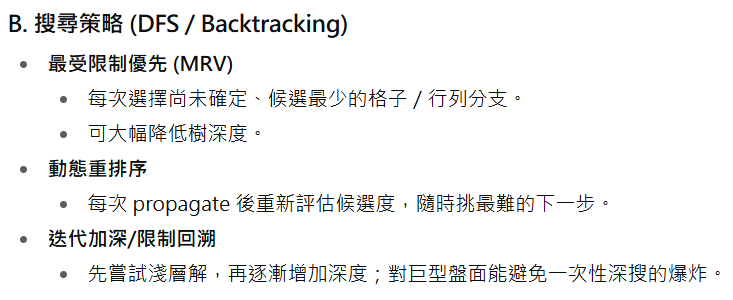
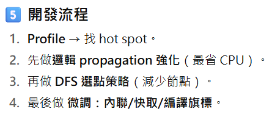

# Logic Rule Nonogram

## Logic Rule 執行順序

1. `RLmost_init()`
2. `RLmost()`
3. `leftmost()`
4. `rightmost()`

## CONFLICT RULE

### RLmost

- Total > 25 - start (Total = All clues with one space)
- Start + 1 < Total (Total = 0 ~ Current Clue)
- 線索長度不合
- 不是對應到同個線索

### Leftmost & Rightmost

- 已經到最後一格了，但是還沒有填完所有的 clue

### 檔案結構

├─include
│      board.h
│      cdef.h
│      fullyprobe.h
│      Hash.h
│      help.h
│      linesolve.h
│      mirror.h
│      options.h
│      probsolver.h
│      scanner.h
│      set.h
│      
├─logs
├─obj
│      board.o
│      fullyprobe.o
│      Hash.o
│      help.o
│      linesolve.o
│      main.o
│      mirror.o
│      options.o
│      probsolver.o
│      scanner.o
│      set.o
│      
├─src
│      board.cpp
│      fullyprobe.cpp
│      Hash.cpp
│      help.cpp
│      linesolve.cpp
│      main.cpp
│      mirror.cpp
│      options.cpp
│      probsolver.cpp
│      scanner.cpp
│      set.cpp

- main
- probsolver
- 

## Idea
https://www.reddit.com/r/puzzles/comments/eawno1/what_strategies_can_i_use_to_start_solving/?tl=zh-hant
1. double hash
2. 或許可以從線索總和最長的line開始解
3. 邊界推理法
3. 把memcpy改成交換指標或使用 std::array 搭配 std::copy
4. __SET, __GET 以 constexpr inline 函式取代
5. 使用 __builtin_popcountll, __builtin_ctzll，比手動 while-loop 快




09/18
- 把建醫(邏輯優化)、家駿(組合優化)、信服(邏輯未優化)學長用profiler測試差在哪
- 把建醫學長的邏輯propagate加上家駿學長的fp + backtracking
- 把建一、家駿學長的程式跑first propagate，比較時間

1009
把RLmost最後檢查CONFLICT那段刪掉，結果：

原：


## 0120
1. 把Conflict判斷在logicRule執行完RLmost後就做
```
1. remaining_cells < sum(clue_len) + gaps
2. 黑區段數 > clue 數(現在在規則 2 / 3 才做)
3. if minStart > maxStart → conflict
```
2. (TCGA2021前300)此次實作優化後速度快25%，DFS次數下降27，first propagate的line solve次數降低4712

抓跟原先版本的填點數是從哪裡產生差別(哪個rule、節點...)

## 0201
1. logicRule step 4、5、8貢獻解點為0

1. 在step 7後、step 8前印出盤面比較跟學長的差在哪
2. 紀錄每個conflict判斷成功幾次
3. 整理出不同方法的魔王題差在哪

## 0311
1. 把logicRule改為用queue存要解的line
2. logicRule初始化q 0-25可以快三倍，但DFS多一倍，反之(0-50)
3. M=4最快

做分析看哪些改變(各項排列組合逐一比較)跟原本學長的比造成哪些影響 收集實驗數據